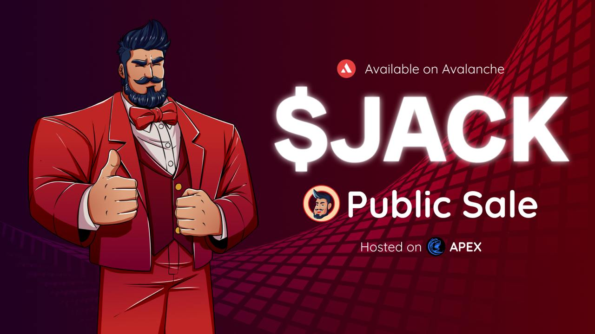

# Stable Jack: Yield, Volatility and Points Market

<figure><figcaption></figcaption></figure>

Stable Jack is a yield, volatility, and points market for any asset. Investors can access fixed and leveraged yield, farm airdrops with leverage, and long any asset without liquidation risk.

As a Sonic Boom and Ethena Accelerator winner, Stable Jack achieved an **80% retention rate** and more than **5,000 users**. With this momentum behind it, Stable Jack is ready to dominate the DeFi ecosystem.

Stable Jack innovates a new tokenomics model, called **Discount Tickets**. This community-first approach limits token inflation and sell pressure through demand-based unlocks, which benefits the long-term holders. Also, as part of **$JACK tokenomics**, the protocol will buy back $JACK from the market with the protocol revenues and share the revenue with $JACK holders.

## Why Stable Jack?
✔ **Fixed Yield** – Earn predictable, high-yield returns on stablecoins, no maturity date required.  
✔ **Leveraged Yield** – Maximize returns on stablecoins and blue-chip assets with the highest market yield.  
✔ **Leveraged Airdrop Farming** – Gain exposure to airdrops without risking principal.  
✔ **Leveraged Long Without Liquidation** – Go long on your favorite assets with leverage, no liquidation risk.  
✔ **No Principal Risk** – Secure high returns while protecting your capital.  
✔ **No Maturity Date** – Set and forget—your positions remain active.

## Comparison Analysis
Stable Jack is based on a **pool model (not AMM)**, preventing impermanent loss & price slippage, making it more efficient for both LPs and investors.

<figure><figcaption></figcaption></figure>

There is a significant growth opportunity in the yield market as the ecosystem matures, and as is the case with every sector, innovative projects will lead the next leg of this growth!

Compared to other yield protocols, Stable Jack’s ability to offer **principal protection**, **no slippage**, and **no IL** is a strong value proposition that can’t be copied.

This advantage gives Stable Jack a **HUGE room to grow**!

<figure><figcaption></figcaption></figure>

## Achievements
🏆 **Sonic BOOM Winner** – Eligible for significant Sonic Gems (points) & airdrops  
🏆 **Ethena Accelerator 2nd Place** – Launching on Ethena Network from Day 1  
🏆 **Helius Labs Startup Launcher**  
🏆 **Winner of Avalanche DeFi QF by Gitcoin**

Stable Jack is also backed by notable investors, securing **$1.7M** from Blizzard Fund, Bitcoin Layer-2s like GOAT Network, BENQI, Yield Yak, Colony ESF, and esteemed angels from the Sonic & Avalanche communities.

## Catalysts for Future Growth
- **Chain Expansion** – Ethena Network and Hyperliquid  
- **RWA Exposure** – Partnering with Misyon Bank to accept tokenized Turkish Money Market Fund as collateral, new RWA partnerships are coming soon!  
- **CeFi Integration** – Collaborating with MENA & Turkish exchanges to integrate Stable Jack products  
- **DeFi Agent** – A consumer AI product that automates and simplifies the DeFi user experience  
- **Mobile App** – Aggregating DeFi products for retail users in the MENA region  

## Partners
Stable Jack has partnered with major ecosystem protocols like Royco, Agora, BENQI, Rings Protocol, Beets Protocol, and more. Stable Jack is the winner of the **Ethena Accelerator Program** and also part of the **Helius Startup Launchpad Program**.

Stable Jack has been working with the best teams in security services like **Dedaub** and **Hexagate**.

<figure><figcaption></figcaption></figure>

## Tokenomics
Stable Jack’s **Discount Tickets Model** (inspired by Andre Cronje’s Options Liquidity Mining) ensures:

✅ **Demand-based unlocks** – No inflationary token emissions, new JACK tokens only enter circulation when there’s a demand.  
✅ **No unnecessary sell pressure** – Rewards long-term holders and users instead of mercenary capital.  
✅ **Protocol-Owned-Liquidity** – Enables Stable Jack to raise POL for buybacks, ensuring a sustainable token economy.  
✅ **Value Accrual to $JACK** – Revenue-sharing, buybacks, & airdrops from partner protocols.

<figure><figcaption></figcaption></figure>

## SALE DETAILS
- **Token**: $JACK  
- **Total Tokens for Sale**: 500K $JACK  
- **Fully Diluted Valuation (FDV)**: $20M  
- **Unlock Schedule**: Fully unlocked at TGE

### Disclaimer
This sale is for aJACK, which is a placeholder token for this sale. The real JACK token will be airdropped to all wallet addresses participating in this sale upon TGE.

After concluding the raise, we will be launching the token on DEXs on **April 2nd**, the details will be communicated.