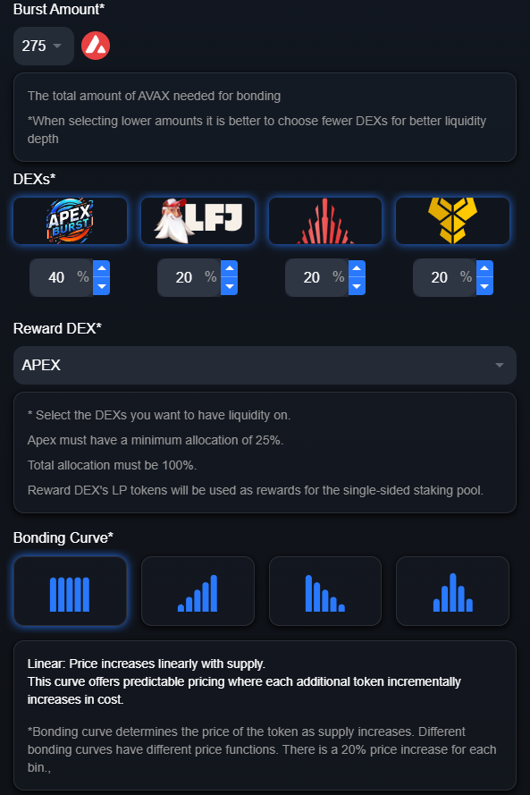

# ☀️ Why Choose Apex Burst

### Why Choose Apex Burst?

Apex Burst offers a unique, feature-rich platform for token creators looking to launch with maximum customization, flexibility, and support. Here’s how Apex Burst stands out from other token launch platforms:

#### 1. **Customizable Launches**

* **Branded Experience**: Personalize your token launch with banners, social media links, and even a custom sound effect that plays on each buy or sell. This helps build a distinct identity and connect with your audience in a way that other platforms simply don't offer.
* **Variable Launch Requirements**: Set your own "burst threshold"—from as low as 50 to as high as 2000 AVAX or native tokens. This lets you control the required momentum for a successful burst, tailoring your launch to your goals and community size.

<figure><figcaption></figcaption></figure>

#### 2. **Flexible Liquidity Deployment**

* **DEX Selection**: Choose from multiple decentralized exchanges (DEXs) to automatically deploy your token’s liquidity. This flexibility allows you to reach the platforms most aligned with your target audience and trading goals.
* **Custom Allocation**: Adjust the liquidity allocation for each DEX you select, allowing for strategic deployment across various platforms to maximize trading exposure and depth.

#### 3. **Creator Earnings**

* **4% Success Fee**: If your token successfully bursts, you earn 4% of the total AVAX raised. This provides creators with significant incentive and reward for a successful launch.
* **Bonding Rewards**: During the bonding phase, creators receive 0.25% of all transaction volume (buys and sells), offering additional earning potential as users engage with the token.

#### 4. **Built-In Staking Rewards**

* **DEX-Rewarded Liquidity Pools**: Apex Burst allows creators to select the reward LP tokens for the Burst Staking Pool, encouraging holders to stake their tokens while providing ongoing engagement with the chosen DEX ecosystem.
* **LP Staking Pool**: Apex also offers an LP staking pool on our [Earn](https://apexdefi.xyz/earn) page, where users can stake their LP tokens to earn $Apex rewards. This provides an additional layer of engagement and incentives for users, helping to drive liquidity and trading activity while rewarding loyal holders.

#### 5. **Instant Tradability**

* Upon a successful burst, the token becomes instantly tradeable on all the selected DEXs, offering immediate liquidity and access for users. This seamless integration enables rapid token adoption and trading activity right after launch.

Apex Burst combines robust customization options, flexible liquidity management, and strong incentives for creators, making it a powerful platform for launching your next token. Choose Apex Burst for a tailored, rewarding, and immediately impactful token launch experience.
